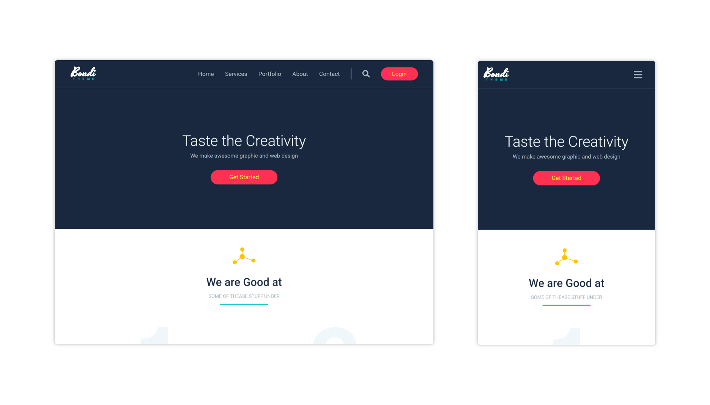

# Bondi Theme Agency's Website
This is a website for "Bondi Theme" Agency created with HTML and CSS.

**Note:** This website is created for practicing on the front-end.

## Design View

## Live Demo
👁 [Click here](https://mohammadjarabah.github.io/Bondi-Theme-Agency-Website) to check out the live demo!

## Technologies Used
* 
* 

## Features
* 🤖 Responsive design on all devices
* ⚡ Fast and lightweight design
* 🍫 Responsive navigation bar with custom designs for desktops & mobiles
* 🌐 Sections for 'header', 'services', 'portfolio', 'about us', 'team members', 'clients', 'advertise', 'blog', 'newsletter', and 'footer'
* 👓 Simple animation when hovering on the images of the 'portfolio' section
* 🌍 Footer section with 4 columns of content, links, and copyrights
* ✨ And more!

## Credits
* PSD Template is from [Graphberry](https://www.graphberry.com)
* Fonts are from [Google Fonts](https://fonts.google.com)
* Font Icons are from [Font Awesome](https://fontawesome.com)
* Images are from [Unsplash](https://unsplash.com)
