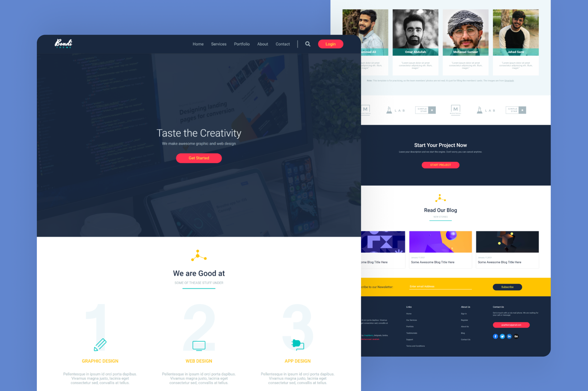

<h1 align='center'>Bondi Theme Agency Website</h1>

This project is a landing page for a digital agency by turned a PSD web template into a responsive website using HTML and CSS. It showcases the agency's portfolio, services, and expertise with a clean design and easy navigation for users on all devices.

## Preview

## Live Demo
👁 [Click here](https://mohammadjarabah681.github.io/bondi-theme-agency-website) to check out the live demo!

## Technologies
* HTML
* CSS (with BEM Methodology)

## Features
* ⭐ Single page design
* 👓 Elegant favicon
* 🤖 Responsive design on all devices
* ⚡ Fast and lightweight design
* 🍫 Responsive navigation bar with custom designs for desktops & mobiles
* 🌱 Smooth scroll for navigation bar links
* 🌐 Sections for 'header', 'services', 'portfolio', 'about us', 'team members', 'clients', 'advertise', 'blog', 'newsletter', and 'footer'
* 🌠 Simple animation when hovering on the images of the 'portfolio' section
* 🌍 Footer section with 4 columns of content, links, and copyrights
* 🎨 SVG logo & icons (except the 'clients' section)
* ✨ And more!

## Credits
* PSD Template is from [Graphberry](https://www.graphberry.com)
* Fonts are from [Google Fonts](https://fonts.google.com)
* Font Icons are from [Font Awesome](https://fontawesome.com)
* Images are from [Unsplash](https://unsplash.com)

## License
This project is licensed under the [MIT License](./LICENSE).